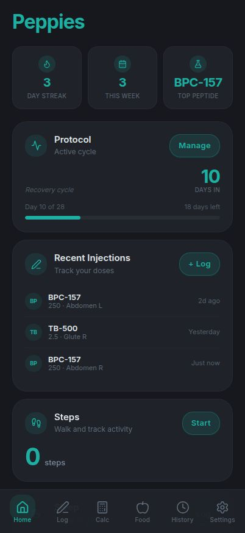
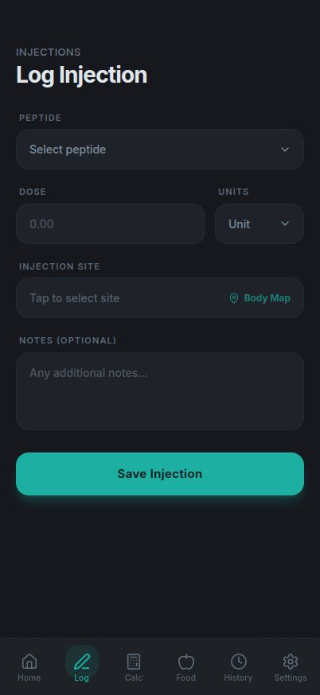
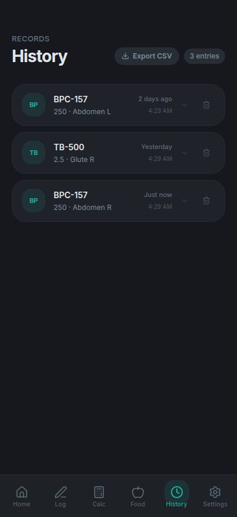
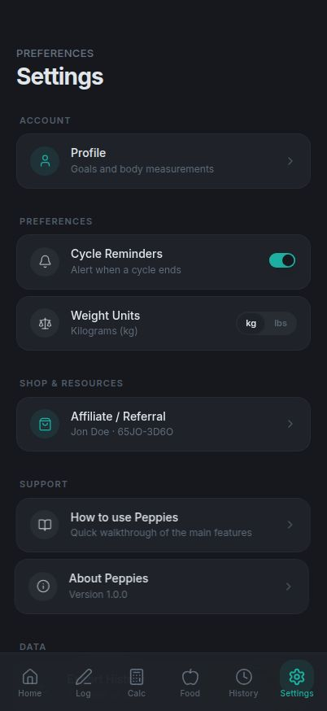

# Peppies

> A dark-mode, mobile-first PWA for peptide protocols — log injections, calculate doses, and track the daily metrics that go with them. All on your device, all yours.

<p align="center">
  
  
  
  
</p>

Peppies is a single-page web app that replaces the tangle of notes, spreadsheets, and reminder timers most people use to keep track of a peptide protocol. It's installable as a PWA, works offline after the first load, and stores everything in your browser — no account, no server, no analytics.

**Live:** published on `.replit.app`
**Status:** active personal project, used daily

---

## Features

### Peptide tools
| | |
|---|---|
| **Injection log** | One-tap logging with peptide, dose, site, and time. Quick-repeat your last shot. |
| **Dose calculator** | Convert between mg, mcg, mL, and IU using vial concentration and syringe size. Remembers your last calc per peptide. |
| **Cycle tracker** | Start, pause, and end protocols. Optional browser notification when a cycle ends. |
| **Body-map site picker** | Rotate injection sites visually so you can see what you used last. |
| **History + CSV export** | Chronological log of every injection and cycle, exportable as a spreadsheet. |
| **Peptide reference** | Built-in info for common research peptides. |

### Daily metrics
- **Weight** with trend line
- **Sleep** (hours + quality)
- **Hydration** (cups / liters)
- **Steps** with a daily goal
- **Calories & macros** — barcode scanner (Open Food Facts), manual entry, macro ring on the home screen

### Referral system
Most people on peptides got there through a friend or vendor referral, and most vendors have an affiliate program. Peppies makes that loop frictionless:

- **Save your vendor's referral** (name + code + link). A prominent **Shop Peptides** button appears on the home screen and opens the vendor in your browser.
- **Share with friends** — generates a Peppies link with `?ref=...` baked in. When a new user opens it, the disclaimer screen pre-fills with your referral. Includes a counter of how many friends you've shared with.
- **Personal link slot** — a second, private link just for you (for example, one a friend shared with you *after* you signed up). Never included when you share Peppies onward.

### Quality of life
- **14-step in-app How-to guide** explaining every feature
- **JSON backup & restore** — export your whole app state as one file, import it on a new device or after clearing browser data
- **Disclaimer onboarding** the first time you open it
- **Installable on iOS and Android** home screens — feels native after install

---

## Tech stack

- **React 18** + **TypeScript** — strict mode
- **Vite** — build, dev server, and `vite-plugin-pwa` for the service worker
- **Tailwind CSS** + **shadcn/ui** primitives
- **wouter** — tiny routing library
- **framer-motion** — animations and sheet transitions
- **lucide-react** — icons
- **localStorage** — every piece of user data; no database, no API, no auth

Monorepo orchestrated with **pnpm workspaces**.

---

## Repository layout

```
.
├── artifacts/
│   ├── peppies/              ← the app
│   │   ├── src/
│   │   │   ├── App.tsx          routing + onboarding + referral intake
│   │   │   ├── main.tsx         React mount
│   │   │   ├── index.css        Tailwind base + dark theme
│   │   │   ├── pages/           Home, Log, Calculator, History, Nutrition, Steps, Settings
│   │   │   ├── components/      cards, sheets, dialogs, plus shadcn ui/
│   │   │   ├── hooks/           useInjections, useAffiliate, useCycles, useWeight, …
│   │   │   ├── utils/           backup, affiliateShare, exportCsv, openFoodFacts, …
│   │   │   ├── data/            built-in peptide reference
│   │   │   └── lib/
│   │   ├── index.html
│   │   ├── vite.config.ts
│   │   ├── tsconfig.json
│   │   └── package.json
│   ├── api-server/           ← unused scaffold
│   └── mockup-sandbox/       ← unused scaffold
├── package.json
├── pnpm-workspace.yaml
├── LICENSE
└── README.md
```

> `api-server` and `mockup-sandbox` are inert scaffolds from the monorepo template. Peppies itself uses neither — all app code lives under `artifacts/peppies/`.

---

## Running locally

Requires Node 20+ and pnpm.

```bash
pnpm install
pnpm --filter @workspace/peppies run dev
```

The dev server binds to `$PORT` (Vite reads it). Open the URL printed in the terminal.

Production build:

```bash
pnpm --filter @workspace/peppies run build
```

Typecheck:

```bash
cd artifacts/peppies && pnpm exec tsc --noEmit
```

---

## Data & privacy

- **No backend.** Nothing leaves your browser unless you tap Share.
- **No analytics.** No tracking pixels, no third-party scripts, no server-side logs of your activity.
- **All data lives in `localStorage`** under `peppies_*` keys.
- **Backup** in Settings exports a single JSON file containing every `peppies_*` key. Restore overwrites the same keys.
- **Share** uses the native Web Share API where available (iMessage, WhatsApp, Mail, AirDrop), with a clipboard fallback when it isn't.
- **Your personal link is never shared.** Only your main affiliate info is included in shared referral links.

---

## Roadmap

Rough sketch of what may come next. None of this is promised — Peppies is a personal project, shaped by what I actually need.

- [ ] **Charts on the History page** — sparklines for weight, sleep, and adherence
- [ ] **Multi-protocol view** — compare two cycles side by side
- [ ] **Reminder schedules** — recurring daily / weekly injection reminders, not just end-of-cycle
- [ ] **Photo log** — optional progress photos kept in IndexedDB
- [ ] **Templates** — save a full protocol (peptide + dose + cadence) as a reusable template
- [ ] **iCloud / Drive backup** — opt-in encrypted backup target so you don't have to manage JSON files manually
- [ ] **Apple Health / Google Fit** read-only sync for weight and steps
- [ ] **Localization** — at minimum metric/imperial toggle for weight, then proper i18n
- [ ] **Print-friendly history** — a clean view to share with a healthcare provider

If you'd like to suggest something, open an issue.

---

## Disclaimer

Peppies is a personal logging and reference tool. **It is not medical advice, not a medical device, and not a substitute for a qualified healthcare provider.** It does not prescribe, diagnose, or treat anything. Many peptides tracked in the app are research compounds not approved for human use. You are responsible for your own decisions.

---

## License

[MIT](./LICENSE) — do what you want, no warranty, and please don't pretend the app is medical advice.
